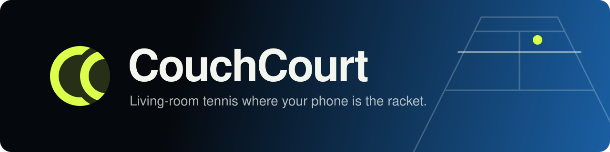
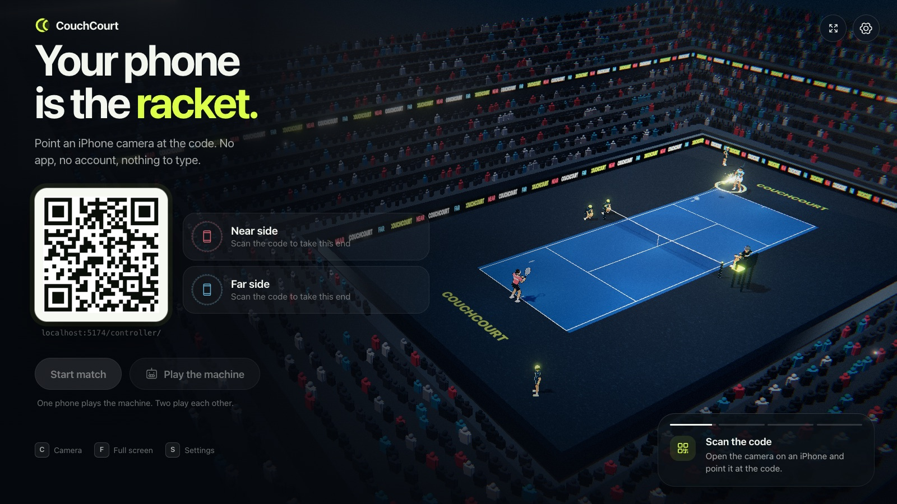
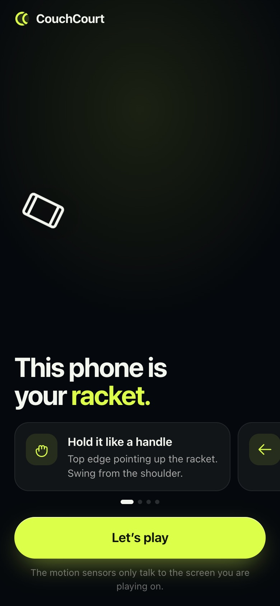
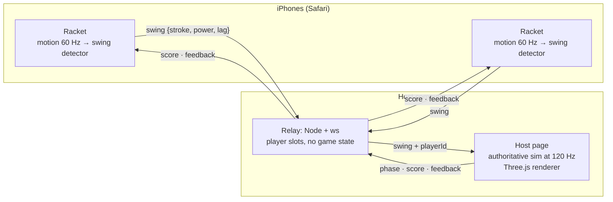

<p align="center">
  
</p>

<p align="center">
  <b>An experiment in giving a coding agent long-term memory, and holding it to test-first discipline.</b><br />
  <sub>Built with <a href="https://claude.com/claude-code">Claude Code</a> and a knowledge vault it reads before every session and writes back to after.</sub>
</p>

<p align="center">
  <a href="https://github.com/kuehn-lars/CouchCourt/actions/workflows/ci.yml"></a>
  <a href="LICENSE"></a>
  <br />
  
  
  
  
  
  
  
  
  
</p>

---

## Your laptop is the stadium. Every phone is a racket.

CouchCourt turns a laptop and a couple of iPhones into a local multiplayer
tennis game you play by swinging. The laptop shows the court. Each guest scans
a QR code, taps once to allow the motion sensors, and from then on their phone
is the racket. A forehand sends the ball one way, a backhand the other, and how
hard you swing is how hard you hit.

There is nothing to install on either end: no app, no account, no controller to
charge, and no internet beyond the Wi-Fi everyone is already on.

<table>
  <tr>
    <td width="76%"></td>
    <td width="24%"></td>
  </tr>
  <tr>
    <td align="center"><sub>The host: scan the code to take a side</sub></td>
    <td align="center"><sub>The iPhone: one tap and it's a racket</sub></td>
  </tr>
</table>

### The idea

Consoles solved everyone-in-one-room, and people loved it. Phones inherited the
audience and lost the format. Gathering round one screen is still fun, but an
app store put a download, an account and an update between a guest and the
game.

Meanwhile every guest already carries a motion controller: an accelerometer, a
gyroscope and a browser. The only missing piece was permission to read
the sensors from a web page, and iOS grants that with one tap. That is why the
constraints are zero install, zero accounts and local only. Drop any of them
and the guest is back to downloading something.

## Features

- **Swing to play.** The phone's gyroscope reads forehand, backhand, overhead
  smash and serve on the phone itself. Swing speed is shot power.
- **Timing is the skill.** Hit on time and you get a paced, angled ball. Early
  goes wide, late goes long. Players run to the ball automatically, so all you
  do is swing.
- **Scan and play.** A QR code on the TV, one tap on the phone. Lock your phone
  mid-match and you come back as the same player on the same side.
- **Play the machine** with one phone, or a friend with two. Split screen puts
  each half behind its own player.
- **A floodlit night stadium** with cel-shaded athletes, a living crowd, bloom,
  an umpire who calls the score, and synthesised sound. There are no image or
  audio files; every asset is drawn or generated in code.
- **Real HTTPS on your LAN** with a publicly trusted certificate, so guests
  never see a warning or install a profile. Its private key is public by
  design. That buys the browser's trust, but gives you no privacy from others
  on the same Wi-Fi.

## How it works



- **The phone does the sensing.** Swing detection runs on the device, so the
  wire carries a few small events per rally instead of a stream of raw sensor
  data.
- **The host browser is the game.** The simulation is a pure, deterministic
  `tick(state, inputs, dt)` that runs in the host's browser. The server is a
  relay that holds player slots and nothing else.
- **Latency is measured.** The phone reports how late its detector fired, and
  the host subtracts it. Swings are judged against one frozen contact point per
  ball: early swings wait for it, late ones are rewound to it.

## Engineering highlights

Most of the hard problems had nothing to do with tennis.

| | |
| --- | --- |
| **Purity enforced by the compiler** | `src/shared`, which holds the whole simulation and swing detector, cannot see the DOM or Node. Three tsconfig projects make an accidental `window` a type error, which is why more than 450 tests run in two seconds without a browser or a phone. |
| **Tuned against real motion** | 26 recorded iPhone motion traces are committed as fixtures: forehands, backhands and serves, plus the negatives, which matter more. A phone on a table, in a pocket, someone walking, someone talking with their hands: none of those may ever read as a swing. |
| **HTTPS on a LAN, with no warning** | iOS refuses motion sensors outside a secure context. The fix is a publicly trusted wildcard certificate for hostnames that resolve to private IPs, plus a diagnosis script for the home routers that silently drop that DNS answer. |
| **Found on real GPUs** | Two rendering bugs only show on Apple's Metal driver: a multisampled target discarded after resolve, and a `pow()` of a slightly negative number returning NaN, which bloom smeared into black blocks. Both were reproduced in headless Chrome on the real GPU and fixed at the cause. |
| **Every decision written down** | More than twenty architecture decision records, each listing the alternatives that were rejected: why Three.js over Phaser, why raw WebSockets over Socket.IO, why swing timing uses the host's clock and never the phone's. |

## The experiment: an AI with a memory

I built CouchCourt almost entirely by pair-programming with
[Claude Code](https://claude.com/claude-code). The game was the vehicle; what I
wanted to test was the memory.

A coding agent starts every session knowing nothing. This project's hard parts
are platform quirks, constants found by measurement and dead ends, and the code
shows none of them. So the repository carries its own long-term memory:

- [`llm-knowledge/`](llm-knowledge) is an [Obsidian](https://obsidian.md) vault
  of 60-odd notes: an [architecture map](llm-knowledge/architecture.md), one
  page per module, decision records, platform notes and measured experiments.
- [`CLAUDE.md`](CLAUDE.md) is the working contract. Read the vault's
  [index](llm-knowledge/index.md) first. Keep a session log while working.
  Work test-first, and watch every test fail before trusting it. Before
  finishing, promote anything that will still be true in a month into the
  vault.
- `npm run vault:check` runs in CI. It fails on a broken link, an orphaned
  note, a pointer to a file that no longer exists, or a source folder with no
  module page, so the memory cannot quietly rot.
- [`llm-knowledge/log.md`](llm-knowledge/log.md) is the project's history in
  the agent's own words, including what was tried and abandoned.

## What I learned

The shared knowledge base made coding with an AI agent a lot easier.

- **No re-explaining.** When a chat got too long and I had to start a new one,
  I didn't have to explain the context again. The next session read the index
  and picked up where the last one stopped.
- **Faster than one big `MEMORY.md`.** The agent read only the notes relevant
  to the feature it was working on, instead of loading everything every time,
  and it got to work faster.
- **Manual changes made it into the wiki too.** When I changed something by
  hand, the agent wrote it into the vault, so the next session knew about it.
- **Session logs helped.** Each session kept a running log of what it did, what
  it found and what failed, so an interrupted session left something usable
  behind.
- **Test-first had to be a rule.** "A green test you never saw fail" became
  one after it bit three times on the first day.
- **A note is a claim.** At least one confidently wrong note had to be caught
  by re-running the experiment behind it. The vault is only as good as the
  habit of checking it against the code.

It worked great.

## Getting started

**You need:** a computer with Node 24.3 or newer ([`.nvmrc`](.nvmrc) picks the
Node 24 LTS) and a recent desktop browser, an iPhone on the same Wi-Fi, and a
router that does not block DNS rebinding. Most don't, and the setup script
checks.

I developed and played it on macOS. Nothing in it is Mac-specific: the server
is plain Node, and certificate setup uses Node's own crypto, not `openssl`.
Windows and Linux should work too, but I haven't played on either yet. On
Windows, allow Node through the firewall on **private networks** when it asks,
or the phones cannot connect.

```bash
npm install
npm run certs   # fetch TLS certificates for your LAN address and print the URLs
npm start       # build, serve both pages, host the relay, and print the URLs
```

Then open the **Host** URL that `npm start` prints. It is a `*.my.local-ip.co`
name for your LAN address, the only kind of name the certificate covers. The
same address as a bare IP gets a certificate warning, and the QR code on the
host page would hand that warning to every phone.

> [!NOTE]
> iOS only exposes the motion sensors to a secure page, so HTTPS is required.
> If Safari says the hostname does not resolve, your router is dropping the DNS
> answer. It is a one-time router setting, and `npm run certs` tells you where
> to look. Details are in
> [`platform/lan-https-dns-rebind.md`](llm-knowledge/platform/lan-https-dns-rebind.md).

### Playing

1. Open the host URL on the computer. The title screen shows a QR code.
2. Scan it with an iPhone camera and tap **Let's play**. That one tap grants
   the motion sensors and is also your ready signal.
3. **Start match** with two phones in, or **Play the machine** with one.
4. Hold the phone like a racket handle, top edge up, and swing.

| Key | |
| --- | --- |
| `C` | Cycle the camera: broadcast, follow, side-on |
| `F` | Full screen |
| `S` | Settings |

### Commands

| Command | What it does |
| --- | --- |
| `npm start` | Build, then serve both pages and the relay, and print the URLs to open. This is how you play |
| `npm run dev` | Vite dev server with hot reload and the motion trace recorder |
| `npm run certs` | Fetch LAN certificates, diagnose router DNS |
| `npm test` | Vitest |
| `npm run typecheck` | All three tsconfig projects |
| `npm run check` | Biome lint and format check (`npm run format` writes fixes) |
| `npm run build` | Production build into `dist/` |
| `npm run vault:check` | Knowledge vault integrity |

CI runs everything except `dev` and `certs` on every pull request, on Linux,
Windows and macOS.

## Project layout

```
src/shared/       pure logic: wire protocol, simulation, swing detection
src/server/       the WebSocket relay and player slots
src/host/         the host display: match state machine, Three.js renderer, audio
src/controller/   the iPhone racket: permission gate, swing stream, string bed
scripts/          Vite plugins, certificate setup, the vault checker
tests/            integration tests and 26 recorded motion traces
llm-knowledge/    the Obsidian vault: the project's long-term memory
```

## Status

It is played and working on real phones: an iPhone 14 Pro and an iPhone 16e,
over LAN HTTPS, against a Mac host that holds 60 fps on an Apple M3. Before any
phone touched it, a full set was played to 6–0 and rematched in headless
Chrome, driven through the real pages over the real relay.

Next comes measurement: how often a swing is read as the wrong stroke, and
tuning the timing window against real players instead of a simulated one. The
most useful thing anyone could contribute is single swings recorded at rally
spacing.

Out of scope on purpose: doubles, manual player movement, play across
networks, custom characters, and accounts or stats.

## License

[MIT](LICENSE) © 2026 Lars Kuehn

## Acknowledgements

CouchCourt is built on:

- [three.js](https://threejs.org), the renderer behind the whole stadium.
- [ws](https://github.com/websockets/ws), the small, fast WebSocket server the relay is built on.
- [Vite](https://vite.dev): dev server, build, and the production server that hosts the relay.
- [qrcode-generator](https://github.com/kazuhikoarase/qrcode-generator) by Kazuhiko Arase, for the join code.
- [Phosphor Icons](https://phosphoricons.com) by Helena Zhang and Tobias Fried, for the UI's icons.
- [local-ip.co](https://local-ip.co), whose publicly trusted certificates for LAN addresses make zero-warning HTTPS possible.
- [Vitest](https://vitest.dev), [Biome](https://biomejs.dev) and [TypeScript](https://www.typescriptlang.org): the test runner, the linter and formatter, and the type system that keeps the simulation pure.
- [Obsidian](https://obsidian.md), for making a folder of Markdown pleasant to think in.
- [Claude Code](https://claude.com/claude-code) by Anthropic, the pair programmer on the other end of the experiment.
